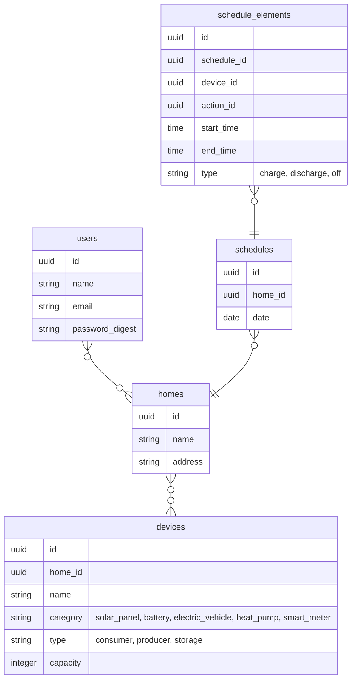

# Entity Relationship Diagram

```mermaid
erDiagram
    users {
        uuid id
        string name
        string email
        string password_digest
    }

    users }o--o{ homes: ""

    homes {
        uuid id
        string name
        string address
    }

    homes }o--o{ devices: ""

    devices {
        uuid id
        uuid home_id
        string name
        string category "solar_panel, battery, electric_vehicle, heat_pump, smart_meter"
        string type "consumer, producer, storage"
        integer capacity
    }

    schedules {
        uuid id
        uuid home_id
        date date
    }

    schedules }o--|| homes: ""

    schedule_elements {
        uuid id
        uuid schedule_id
        uuid device_id
        uuid action_id
        time start_time
        time end_time
        string type "charge, discharge, off"
    }

    schedule_elements }o--|| schedules: ""
```
